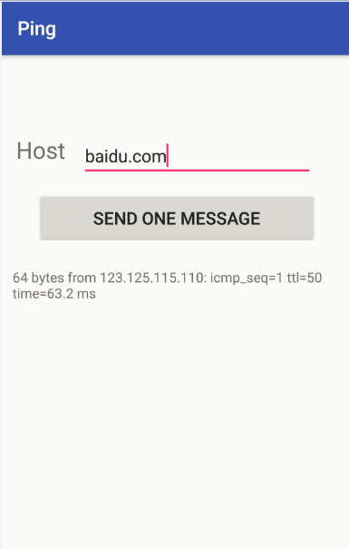

# app_ping_cmd
Android APP for Linux CMD ping demo.

Published to Google Play [here](https://play.google.com/store/apps/details?id=example.ybdesire.com.ping).

# Description 

Ping IP or URL(website).

# Features

* exe cmd
* input ip
* input URL
* ping and get cmd result
* admob
* just ping one message
* no need to stop
* act as linux UI
* get my ip (internal/external)

# Screenshot

